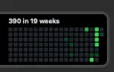
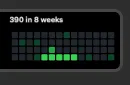
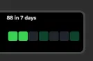
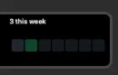
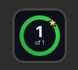

# GitHub Graph

A Stream Deck + plugin that puts my GitHub contributions on the dials and
keys: the graph on the touch strip, and my total, my daily goal and my
streak on keys. It's for anyone with a Stream Deck + who likes seeing their
green squares without opening a browser tab. It's meant to feel cozy. It
sits there, keeps itself up to date, throws confetti when I hit my goal,
and only says something when it can't reach GitHub.


## The five actions

| Action | What it does | Where it goes |
|---|---|---|
| 🟩 Contribution Graph | My recent contributions, in a time range I pick by turning the dial | One dial |
| 📅 Full-Width Graph | A whole year, edge to edge | All four dials |
| 🔢 Contribution Stats | My total for the year, and how fresh the number is | A key |
| 🎯 Daily Goal | A ring that fills toward my target for today | A key |
| 🔥 Streak Counter | A fire that grows the longer my streak goes | A key |

All five share one download. GitHub gets asked once, no matter how many of
them are on screen. Pressing any of them refreshes, and says "updating" for
a second so I can tell the press did something.

### 🟩 Contribution Graph



| Do this | And this happens |
|---|---|
| ↪️ Turn the dial | Steps through the time ranges, and wraps around at the end |
| 🔘 Press the dial | Refreshes |
| 👆 Tap the strip | Opens my GitHub profile in the browser |

The text line is the total for whatever range is showing, like
`390 in 19 weeks`. Each dial remembers its range.

The short ranges get bigger squares, laid out in rows like a calendar:

| 8 weeks | 4 weeks | 14 days |
|---|---|---|
|  |  |  |

| 7 days | This week | This month |
|---|---|---|
|  |  |  |

In "this week" and "this month", the days that haven't happened yet are
dark squares.

### 📅 Full-Width Graph

Put it on all four dials of a page. Each dial draws its own quarter of one
picture, so together they read as one screen.

| Do this | And this happens |
|---|---|
| ↩️ Turn the first dial | Changes the year, back to the year I joined GitHub |
| 🔘 Press any dial | Refreshes |
| 👆 Tap the strip | Jumps back to the last 12 months |

The label on the right says where I am: `12 mo` for the rolling last year,
or a year like `2025`. The other three dials ignore turns on purpose, so
brushing one doesn't move the whole strip.

### 🔢 Contribution Stats


My total since January 1, with a dot that says how old the number is.

| Dot | What it means |
|---|---|
| 🟢 Green | The data is fresh |
| 🟠 Amber | It's more than two refreshes old, which usually means the Mac was asleep |
| 🔴 Red | The last refresh failed, and the words next to it say why |

### 🎯 Daily Goal

| Goal met | Mid-celebration |
|---|---|
|  |  |

The ring fills as today's contributions get closer to my target. The first
time I hit it each day, the ring flashes, a checkmark pops in and confetti
flies off the key for about two seconds. After that a small star sits on
the ring for the rest of the day, and pressing the key plays the
celebration again (because why not).

The target is in the key's settings, from 1 to 20. It starts at 1.

### 🔥 Streak Counter


The number is my current streak, and the fire grows with it. It sways
gently the whole time, and flares up when the key appears, when the streak
changes, and when I press it.

That picture is from the preview page (more on that below), since my own
key can only ever show the tier I'm on.

| Tier | Streak |
|---|---|
| Ember | 1 to 2 days |
| Flicker | 3 to 6 days |
| Candle | 7 to 13 days |
| Lantern | 14 to 29 days |
| Hearth | 30 to 59 days |
| Campfire | 60 to 119 days |
| Bonfire | 120 to 364 days |
| Starfire | 365 days and up |

No streak at all is a cold grey coal.

Two settings, per key:

- **Streak mode.** Daily, weekdays only (weekends can't break the streak
  and can't add to it), or weekly (at least one contribution in a Sunday to
  Saturday week, counted in weeks).
- **Grace days.** How many missed days in a row the streak can survive,
  from 0 to 3. It starts at 1. Missed days never add to the count, and
  weekly mode doesn't use them.

A day with nothing on it yet doesn't break a streak until the day is over.
Otherwise it would read 0 every morning.

To see every tier without waiting a year:

```bash
npm run preview   # builds preview/tiers.html, a page with all eight fires moving
```

Then open `preview/tiers.html` in a browser.

## Setting it up

You need Node.js 24 or newer, the Stream Deck app 7.1 or newer, and a
Stream Deck +.

```bash
npm install                                               # get the SDK and build tools
npm run build                                             # build the plugin into the .sdPlugin folder
npx streamdeck dev                                        # turn on developer mode so Stream Deck loads local plugins
npx streamdeck link com.malikacodes.github-graph.sdPlugin # tell Stream Deck where the plugin lives
```

Then in the Stream Deck app, find **GitHub Graph** in the action list and
drag the actions where you want them. For the full-width graph, add a new
page and drag **Full-Width Graph** onto all four dials.

### The token

The plugin needs a GitHub token to ask for your contributions.

1. Go to <https://github.com/settings/tokens/new> (a classic token).
2. Tick only `read:user`. Nothing else.
3. Generate it, copy it, and paste it into the **GitHub Token** field in
   any action's settings in the Stream Deck app.

Every action shares the same token and the same **Refresh Every** setting,
which starts at 30 minutes. It also refreshes just after midnight, and a
few seconds after the Mac wakes up.

> Heads up: the token is saved in Stream Deck's own app data, not in this
> folder. There's no settings file here to accidentally commit.

## If something's wrong

Every action keeps showing the last good data and adds a short message.
The keys and the full-width graph have less room, so they get a shorter
version.

| On the dial | On a key | What it means |
|---|---|---|
| `Add a token in settings` | `No token` | The token field is empty |
| `Token didn't work` | `Bad token` | GitHub rejected the token (wrong, expired or deleted) |
| `Token can't read this` | `No access` | The token is real but isn't allowed to read the profile |
| `No internet` | `Offline` | The request never reached GitHub |
| `GitHub error 502` | `Error 502` | GitHub answered with an error. The number is theirs |

## Why I built it this way

- **One download for everything.** All five actions read from the same
  place. Adding another key doesn't add another request.
- **The full-width graph stops 60 pixels short of the edge.** Filling all
  800 pixels with 53 weeks needs 15 pixels a week, and seven rows of that
  is 103 pixels tall on a 100 pixel strip. So the squares are 12 pixels,
  the graph is 740 wide, and the leftover column holds the year and the
  Less to More legend.
- **Short ranges aren't drawn GitHub style.** Seven rows cap the squares at
  8 pixels however few weeks there are, so 4 weeks would be a sliver in the
  middle of the dial. Rows of days let the squares grow.
- **Old years are fetched once.** A streak can run back further than the
  12 months a refresh brings in, so the streak key needs the older years
  too. Past years never change, so they're loaded one time when a streak
  key shows up and kept until Stream Deck quits. Only the last 12 months
  refresh.
- **The fires are slim on purpose.** My first go had the big tiers wide
  enough to fill the key, and it was too much. Tall and narrow reads as a
  bigger fire without the bulk, and Starfire stands out by its blue-white
  middle, not its size.
- **The streak key shows one number.** It had my longest streak along the
  bottom for a while, and the tier's name popping up during a flare. I
  took both off. The key is calmer with just the fire and the count.
- **Animations share a budget.** A key can't play a GIF, so an animation is
  really a new still picture sent over and over. Elgato's limit is 10
  pictures a second. Every animated key takes turns on one clock that never
  sends more than that, and the gentle sway on the streak fire gives way
  whenever something louder is playing.
- **The token is a global setting.** A key's own settings are saved as
  plain text and go along for the ride when you export a profile. Global
  settings don't.
- **Logging is turned down.** The SDK template logs every message between
  the plugin and Stream Deck, and one of those messages contains the
  settings. It's set to `info` so the token never lands in a log file.

## What it doesn't do

- It only shows the account the token belongs to. There's no username field.
- Tests cover the streak math only (`npm test`, 21 of them). The drawing
  and everything else I checked by hand on the actual device.
- A year with 54 week columns (2028 is the next one) gets slightly smaller
  squares on the full-width graph. I can't see that one for real until then.
- Two keys animating at the same moment each get half the pictures, so
  they look a little less smooth together than alone.
- The icon for the plugin's category is still the placeholder from
  Elgato's template.
- It isn't on the Elgato Marketplace.

## Changing it later

```bash
npm run build                                       # rebuild after editing anything in src/
npx streamdeck restart com.malikacodes.github-graph # reload the plugin in Stream Deck
npm test                                            # run the streak tests
```

Or `npm run watch`, which rebuilds and reloads every time a file is saved.

How I built it, and what broke along the way, is in the [journal](journal/).
