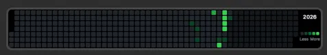
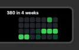
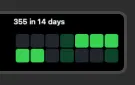
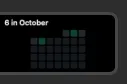
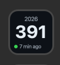
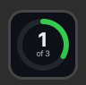
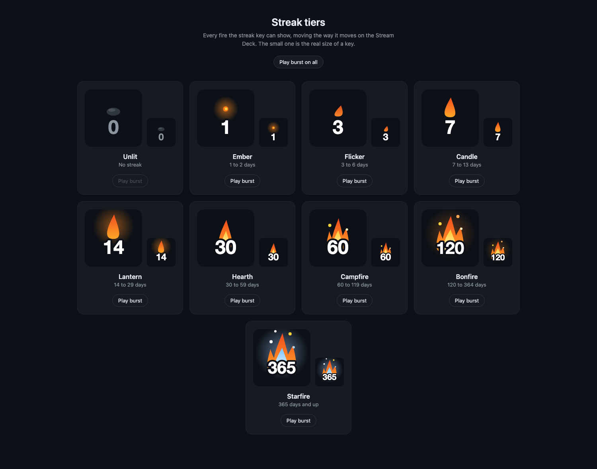
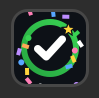

# 02 · One dial turned into five actions (a.k.a. the rabbit hole)

**What happened:** the graph was sitting on my dial, working, done. Then it
clicked. If one dial can show 19 weeks, four dials can show the whole year.
And if the plugin already knows my contributions, it also knows my streak.
And my total. And whether I've hit today's goal. I thought "ouuu, I need
this", and by the next day one action had become five.

| # | Action | Where |
|---|---|---|
| 1 | Contribution Graph, now with time ranges | One dial |
| 2 | Full-Width Graph | All four dials |
| 3 | Contribution Stats | A key |
| 4 | Daily Goal | A key |
| 5 | Streak Counter | A key |



## How it works

**One whiteboard.** Before, the dial fetched its own data. Five actions
doing that would mean asking GitHub five times for the same thing. So now
there's one shared spot (`src/data.ts`) that does the fetching. It's
basically a whiteboard in the kitchen: one person writes on it, everyone
else just looks.

**One picture, four windows.** The full-width graph isn't four graphs.
Every dial draws the same 800 pixel picture and looks at it through its own
200 pixel window. Line the four windows up and it reads as one screen.

**A flipbook.** A Stream Deck key can't play a GIF. So an animation is
really the plugin sending a new still picture over and over, like flipping
the pages of a flipbook. Elgato's limit is 10 pictures a second.

## Steps

**1. Move the fetching to one place**

Nothing changes on screen for this one. The dial just reads from the
whiteboard now.

**2. Stretch the graph across four dials**

Each dial asks Stream Deck which slot it's in, and draws that quarter.

```bash
# on the MAC
npm run build                                       # rebuild after every change
npx streamdeck restart com.malikacodes.github-graph # reload the plugin in Stream Deck
```

In the Stream Deck app: add a new page, then drag **Full-Width Graph** onto
all four dials. Turning the first dial changes the year.

**3. Give the single dial time ranges**

Turn to switch between 19 weeks, 8 weeks, 4 weeks, 14 days, 7 days, this
week and this month. Tap to open my GitHub profile.

| 4 weeks | 14 days | This month |
|---|---|---|
|  |  |  |

**4. The stats key**

My total for the year, and a dot for how fresh it is.



**5. The daily goal key**

A ring that fills up. I used a gradient (a color that fades into another)
on the ring on purpose, as a test. Nobody documents whether a key can draw
one, and I wanted to know before building eight fires out of them.



**6. The streak key**

The streak math lives in its own file with nothing else in it, so it can be
tested without a Stream Deck anywhere near it.

```bash
# on the MAC
npm test          # runs the 21 streak tests
npm run preview   # builds a page with all eight fires, so I can see the ones my streak hasn't reached
```



## Did it work?

- All four dials line up with no seam. I checked on the real strip.
- Turning the first dial goes `12 mo`, 2026, 2025, 2024, 2023 and stops,
  because 2023 is when I joined.
- The goal key threw confetti when I hit 1 of 1. 🎉
- The streak key showed a different number in each mode.
- `npm test` says 21 passed.

## What went wrong (and how I fixed it)

**"Edge to edge" missed by 3 pixels.**

53 weeks across 800 pixels is 15 pixels a week. Seven rows of 15 is 103
pixels tall. The strip is 100. So the squares are 12 pixels, the graph
stops at 740, and the leftover column got the year label and the legend.
Honestly it looks better with the label there.

**I asked for the whole year AND for scrolling.**

If the whole year is already on screen, there's nothing left to scroll to.
Scrolling became "turn the first dial to change the year".

**I pressed the dial and couldn't tell if anything happened.**

It was refreshing. GitHub just answers so fast, and with the same numbers,
that nothing visibly changed. Now every action says "updating" for a full
second after a press.

**I pushed four commits to fill my goal ring, and got one.**

I wanted contributions to test the ring with, so I pushed the four commits
I had waiting. The key said 1. GitHub counts a commit on the day it was
written, not the day it was pushed, and three of mine were from the day
before.

**The first celebration was so polite I almost missed it.**

The ring grew a tiny bit and a few grey specks drifted out. On a key the
size of a postage stamp, that's nothing. Round two: a bright flash, a big
checkmark, colorful confetti flying off the edges.



**Then it was bold but slow and choppy.**

Three and a half seconds felt long. The fix was a shorter run (2.2
seconds), more pictures per second, and most of the movement packed into
the first few pictures. Big jumps hide choppiness. Small steps show it off.

It also stopped counting frames and started checking the clock. A picture
that arrives late shows a later moment, so the celebration always takes the
same time.

**Two keys celebrating at once went over Elgato's limit.**

Two keys at 8 pictures a second is 16, and the limit is 10. Now every
animated key takes turns on one shared clock, like two people sharing one
pen. Together they each get 5.

**After the Mac woke up, everything said "Offline".**

The plugin refreshed the instant the Mac woke, before the Wi-Fi was back.
Now it waits 5 seconds, and tries once more if that fails.

**The fire only moved once a minute.**

It felt like a picture of a fire. Now it sways the whole time, slowly,
about 3 pictures a second, and it steps aside whenever another key is
doing something louder.

**The big fires were way too dramatic.**

From Hearth up, the fires were wide, bushy and nearly filled the key, and
Starfire covered all of it. Way too much. What I wanted was sleek. Now
they're tall and narrow, with fewer tongues and fewer sparks, and Starfire
stands out by its blue-white middle, not its size. The sway got calmer too: every tier moves by the
same few pixels, so a bigger fire doesn't thrash around more.

**I put my longest streak on the key, then took it off again.**

It said `best 9` along the bottom. Once I saw it next to the fire I
decided I didn't like it. Same for the tier's name popping up under the
number when the fire flares. The key is calmer with just the flame and the
number, so the bottom line is empty now unless there's something to say.

**I could only ever see my own tier.**

My streak is at Candle. Starfire is a year away. So there's a preview page
(`npm run preview`) with all eight, and for a little while the settings had
a "test tier" menu to force each one onto the real key. That came back out
before I committed.

## What I learned

- **Look at it on the real thing.** Every "this looks right" on my Mac's
  screen got a second opinion from the actual device, and the device
  disagreed more than once.
- Keys are tiny. If an animation feels like too much on a big preview, it's
  probably about right.
- Front-load the movement. The first three pictures do most of the work.
- A streak has more rules than I thought: weekends, grace days, a day that
  isn't over yet. That's the part that got tests.
- GitHub counts commits by the day they were written.
- "Ouuu, I need this" is how one dial becomes five actions. No regrets.
