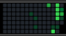
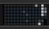

# 03 · Less on the dial

*October 8, 2026*

Two days after giving the dial seven time ranges, I took five of them away
again. Building them was the fun part. Living with them was a lot of
turning to get back to the one I wanted.

| Before | After |
|---|---|
|  |  |

## What I kept

I knew I liked the first view, the graph, and I liked "this week". So
the dial is now those two. Turning it flips between them, and it doesn't
matter which way I turn. Even I can't get lost in two.

## The words came off too

The line on top said things like `390 in 19 weeks`. Without it the graph
gets the whole height of the strip, so the squares grew from 8 pixels to
12 pixels. That's the same size as the full-width graph, which means both
pages finally match. It fits 14 weeks now, down from 19.

## Then where do the errors go?

That text line was also where "No internet" and "Add a token in settings"
showed up. With no words on the dial, those had nowhere to live.

So now the squares turn gray when something's off, and that's my cue to
look in the Stream Deck app.

There's a new **Status** line at the top of the settings that says what's
going on in a full sentence:

It goes gray for a second on every press too, while it refreshes. That
replaced the little "updating" word.

The dial's icon in the Stream Deck app got swapped for a smaller one
while I was in there.

## What I learned

- Seven options is a menu. Two is a switch. A dial I glance at wants a
  switch.
- Taking something off made everything left on it bigger. That keeps
  being true.
- A screen with no room for words can still say "go look over there".
